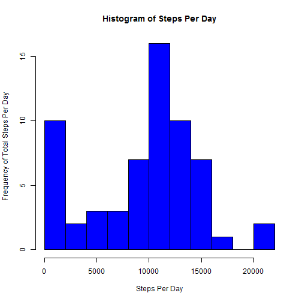
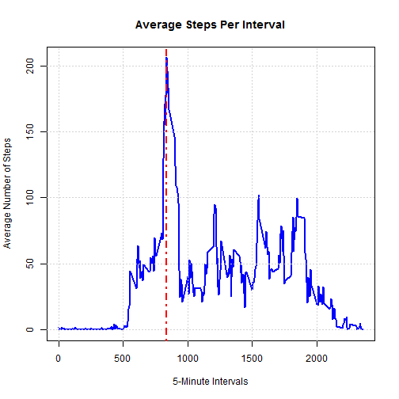
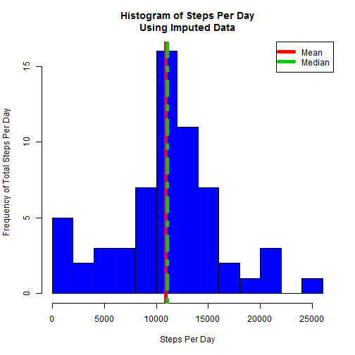
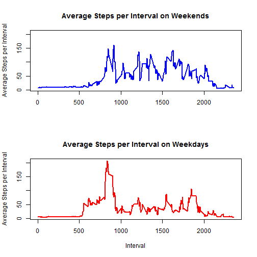

## Load and preprocess the data.
##### Load the data, marking all missing values as "NA".

```r
steps_df <- read.csv("./activity/activity.csv", na.strings = "NA",
                     colClass = c("integer", "character", "integer"))
```

##### Convert dates from a character to a date type variable.

```r
steps_df$date <- as.Date(steps_df$date, "%Y-%m-%d")
```
  
*** 

## What is the mean total number of steps taken per day?
##### Count the number of steps per day ignoring (excluding) missing values.

```r
stepsperday <- tapply(steps_df$steps, steps_df$date, sum, na.rm = TRUE)
```

##### Create a histogram of the total steps per day.
##### Add verticle lines for the mean and the median steps per day.
##### Add a legend for the mean and median lines.

```r
hist(stepsperday, breaks = 10, main = "Histogram of Steps Per Day", 
     xlab = "Steps Per Day", ylab = "Frequency of Total Steps Per Day", 
     col = "blue")
abline(v = mean(stepsperday), col = "red", lwd = 5)
abline(v = median(stepsperday), col = "green3", lwd = 5)
legend("topright", legend = c("Mean", "Median"), col = c("red", "green3"), 
       pch = "-", lwd = 5)
```

 

#### **Mean of the total steps per day: 9354**
#### **Median of the total steps per day: 10395**

***

## What is the average daily activity pattern?
##### Calculate the average steps taken for each 5 minute interval over the 
##### time span of the data.

```r
avgperinterval <- tapply(steps_df$steps, steps_df$interval, mean, na.rm = TRUE)
```

##### Plot the interval breaks vs. the average steps taken per interval as a
##### line plot.  Add a verticle line indicating the interval with the max 
##### number of average steps.  Also add text stating which interval this is.

```r
plot(steps_df$interval[0:length(avgperinterval)], avgperinterval, type = "l",   
     main = "Average Steps Per Interval", xlab = "5-Minute Intervals", 
     ylab = "Average Number of Steps", lwd = 2, col = "blue")
grid(nx = NULL, ny = NULL, col = "lightgray", lty = "dotted")
index <- which.max(avgperinterval)
abline(v = steps_df$interval[index], col = "red", lwd = 2, lty = 4)
```

 

#### **Which 5-minute interval, on average across all the days in the data set,** 
#### **contains the max number of steps?**  
#### **Answer: Interval 835**  
#### **What is the average daily activity pattern?**
#### **Answer: On average, the greatest activity is between 8:30am to about**
#### **9:30am.  On average, most activity is between 5:00am and 10:00pm (22:00).**  
#### **On average, the least activity is between about 10:00pm (22:00) and 5:00am.**  

***

## Imputing missing values
##### Calculate and print out the total number of missing values in the data set.

```r
nacount <- sum(is.na(steps_df$steps))
```

#### There are 2304 missing values in this data set.

##### Create a new data set from the original and impute the missing values with
##### the average for that day.
##### Special note: When calculating the average per day, some NaN values 
##### appeared because there are some days with zero steps.  These NaN values 
##### within the new avgperday list have been replaced with zeroes.

```r
impsteps_df <- steps_df
avgperday <- tapply(steps_df$steps, steps_df$date, mean, na.rm = TRUE)
avgperday[is.nan(avgperday)] <- 0
```

##### Using the indices of the NA values within the steps variable of the
##### impsteps_df dataframe, calculate the proper indices into the 
##### avgperinterval list variable in order to replace the NA values with the 
##### appropriate intervals' average steps.  Since the list variable 
##### avgperinterval has only 288 elements (one for each 5 minute interval 
##### throughout the day), we need to determine which elements of avgperinterval 
##### should be used to fill the elements of the steps variable of the 
##### impsteps_df dataframe which has 17,568 observations from 288 interval 
##### observations over 61 days (288 * 61 = 17,568).  This can be done by 
##### determining the indices of the NA values within the steps variable of the 
##### impsteps_df, dividing this list of values by the number of days within the 
##### study (length of stepsperday), and finally taking the ceiling of these 
##### values.  These indices can then be used to index into the avgperinterval 
##### list to get the appropriate average per interval to replace the NA values 
##### in the steps variable of the impsteps_df.  

```r
intervalindex <- ceiling(which(is.na(impsteps_df$steps))/length(stepsperday))
impsteps_df$steps[is.na(impsteps_df$steps)] <- avgperinterval[intervalindex]
```

##### Calculate the total steps per day with the imputed data and create a
##### histogram with this data.  Add verticle lines for the mean and the median 
##### steps per day.  Add a legend for the mean and median lines.

```r
impstepsperday <- tapply(impsteps_df$steps, impsteps_df$date, sum)
hist(impstepsperday, breaks = 10, col = "blue",
     main = "Histogram of Steps Per Day\nUsing Imputed Data", 
     xlab = "Steps Per Day", ylab = "Frequency of Total Steps Per Day")
abline(v = mean(impstepsperday), col = "red", lwd = 5)
abline(v = median(impstepsperday), col = "green3", lwd = 5, lty = 4)
legend("topright", legend = c("Mean", "Median"), col = c("red", "green3"), 
       pch = "-", lwd = 5)
```

 
       
#### **Mean of the total steps per day after imputing: 
 10890**
#### **Median of the total steps per day after imputing: 
 11015**
#### **Do these values differ from the estimates from the first part of the**
#### **assignment?** 
#### **Answer: Yes.**
#### **What is the impact of imputing missing data on the estimates of the total**
#### **daily number of steps?**
#### **Answer: The total daily sum of steps as well as the mean and median are**
#### **somewhat higher for the imputed data as compared to the non-imputed data.**

***

## Are there differences in activity patterns between weekdays and weekends?
##### Add a column to impsteps_df indicating whether data is from a day during
##### the week or a day during the weekend.  Start by using the weekdays 
##### function to populate this new variable with the day of the week.  Then, 
##### use grep to find indices where days start with "S".  Also, find another 
##### set of indices that do not start with "S".  Use these indices to change 
##### the S-indexed elements to "weekend" and the not-S-indexed elements to 
##### "weekday".

```r
impsteps_df$day <- weekdays(impsteps_df$date)
weekends <- grep("^S", impsteps_df$day)
weekdays <- grep("^[^S]", impsteps_df$day)
impsteps_df$day[weekends] <- "weekend"
impsteps_df$day[weekdays] <- "weekday"
```

##### Calculate the average steps per interval for each weekend/weekday subset.

```r
library(dplyr)
avgperint_day <- impsteps_df %>% 
  group_by(day, interval) %>% summarise_each(funs(mean))
```

##### Plot the average steps per interval for each weekend/weekday subset in 
##### panels.

```r
par(mfrow=c(2,1))
ylimits = c(min(avgperint_day$steps), max(avgperint_day$steps))
avgwkend <- avgperint_day$day == "weekend"
avgwkday <- avgperint_day$day == "weekday"
plot(avgperint_day$interval[avgwkend], avgperint_day$steps[avgwkend], 
     type = "l", xlab = "", ylab = "Average Steps per Interval",
     main = "Average Steps per Interval on Weekends", col = "blue", lwd = 2,
     ylim = ylimits)
plot(avgperint_day$interval[avgwkday], avgperint_day$steps[avgwkday], 
     type = "l", xlab = "Interval", ylab = "Average Steps per Interval", 
     main = "Average Steps per Interval on Weekdays", col = "red", lwd = 2,
     ylim = ylimits)
```

 
     
#### **Are there differences in activity patterns between weekdays and weekends?**
#### **Answer: On weekdays, there seems to be more walking earlier in the day**
#### **whereas on weekends, steps seem to be more evenly dispersed throughout the** 
#### **day.**
     
     
